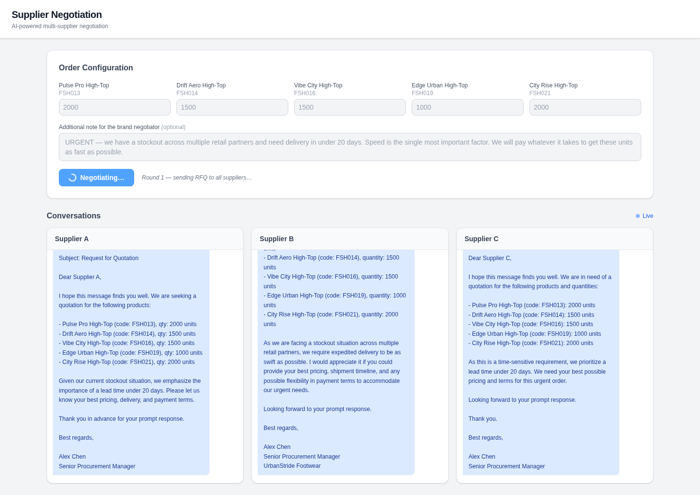
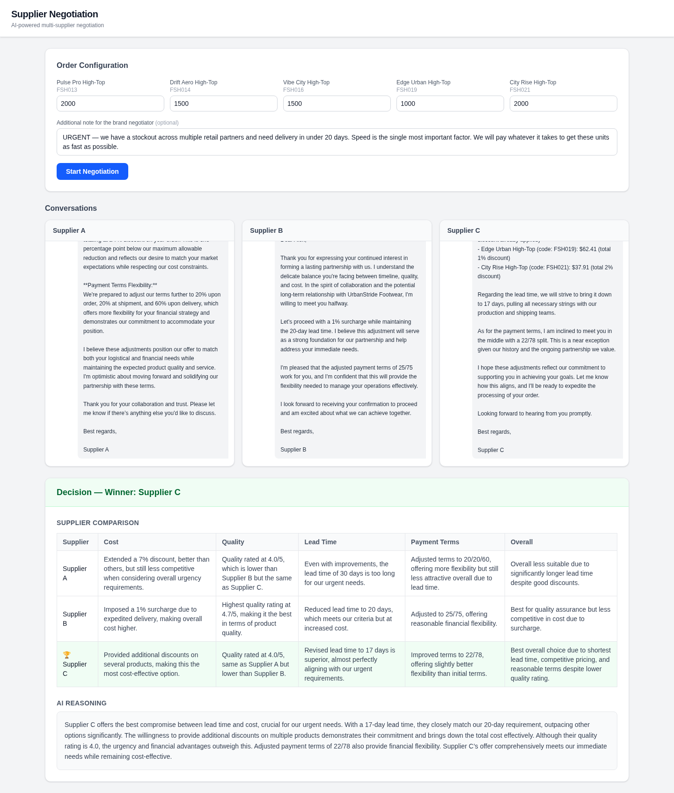

# Supplier Negotiation Agent

AI-powered multi-supplier negotiation app. A brand agent negotiates simultaneously with three supplier agents over WebSocket, comparing offers across cost, quality, lead time, and payment terms, then picks a winner with structured reasoning.

Built as a response to a coding challenge simulating brand–supplier procurement for footwear products.

## Demo — Negotiation Stages

A negotiation proceeds in two stages:

**Stage 1 — RFQ & Multi-Round Negotiation.** The brand agent sends an RFQ to all three suppliers in parallel. Each supplier replies with an initial quote. Over subsequent rounds the brand leverages competing offers to push for better terms.



**Stage 2 — Decision.** Once all rounds complete, the brand agent scores every final offer across cost, quality, lead time, and payment terms, then selects a winner with a structured comparison and written reasoning.



## Architecture

```
React (Vite + TailwindCSS)  ──WebSocket──►  FastAPI
                                              │
                                  ┌───────────┼───────────┐
                              Brand Agent   Supplier 1   Supplier 2   Supplier 3
                              (orchestrator)  Agent        Agent        Agent
```

- **Brand Agent** — generates RFQs, counter-proposals using competitive leverage, and a final structured decision.
- **Supplier Agents** — each has a distinct profile (quality rating, lead time, payment terms, price multiplier) and negotiates independently via LLM calls.
- **WebSocket** — streams every message in real time to the frontend as the negotiation unfolds.

## Prerequisites

- Python 3.11+
- Node.js 18+
- An OpenAI API key (GPT-4o by default)

## Setup & Run

### Backend

```bash
cd backend
python -m venv venv
source venv/bin/activate
pip install -r requirements.txt
cp .env.example .env
# Edit .env and set your OPENAI_API_KEY
uvicorn main:app --reload --port 8000
```

### Frontend

```bash
cd frontend
npm install
npm run dev
```

Open `http://localhost:5173`, configure quantities, and click **Start Negotiation**.

## Configuration

| Variable | Default | Description |
|---|---|---|
| `OPENAI_API_KEY` | — | Required. Set in `backend/.env` |
| `MODEL_NAME` | `gpt-4o` | LLM model used for all agents |
| `NEGOTIATION_ROUNDS` | `3` | Number of negotiation rounds (set in `backend/main.py`) |

## Project Structure

```
backend/
  main.py          # FastAPI app, WebSocket negotiation orchestrator
  agents.py        # BrandAgent and SupplierAgent classes
  models.py        # Pydantic models
  suppliers.py     # Supplier profiles and product loader
  products.json    # Product catalog (5 SKUs)
  config.py        # Env config
scenarios.json               # Pre-built negotiation scenarios for testing
frontend/
  src/
    App.jsx                    # Main UI (controls, chat columns, decision panel)
    hooks/useNegotiation.js    # WebSocket state management hook
```

`scenarios.json` contains 7 ready-made negotiation scenarios, each with specific quantities and a brand note designed to steer the outcome toward a particular supplier. Use them to verify that the agents respond coherently to different priorities (lowest cost, highest quality, fastest delivery, balanced value).
